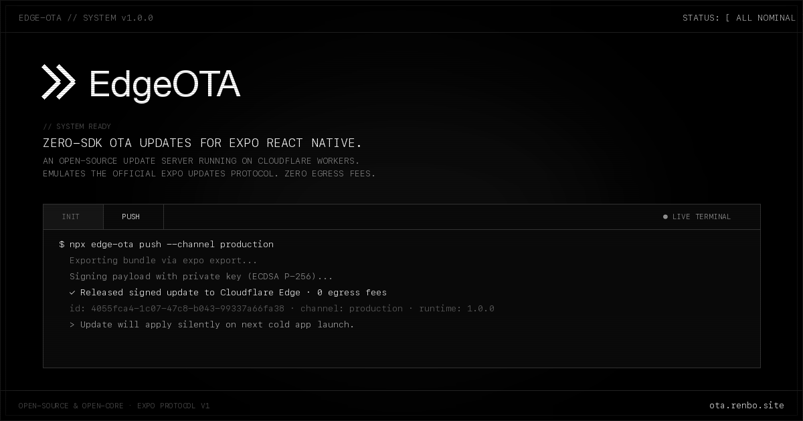
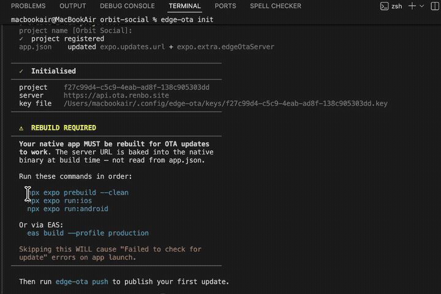

<p align="center">
  <a href="https://ota.renbo.site">
    
  </a>
</p>

<h1 align="center">EdgeOTA</h1>

<p align="center">
  <strong>Zero-SDK, serverless, self-hostable OTA update engine for Expo & React Native</strong><br>
  Push cryptographically signed JS bundles to Cloudflare Edge or your own VPS with zero egress fees.
</p>

<p align="center">
  <a href="https://www.npmjs.com/package/@renbostudios/edge-ota"></a>
  <a href="https://www.npmjs.com/package/@renbostudios/edge-ota"></a>
  <a href="https://github.com/renbostudios/edge-ota/blob/main/LICENSE"></a>
  <a href="https://docs.expo.dev/technical-specs/expo-updates-0/"></a>
  <a href="https://developers.cloudflare.com/r2/"></a>
  <a href="https://www.typescriptlang.org/"></a>
</p>

<p align="center">
  <a href="https://ota.renbo.site"><strong>Cloud Console</strong></a> · 
  <a href="https://ota.renbo.site/docs"><strong>Documentation</strong></a> · 
  <a href="#video-walkthrough"><strong>Video Walkthrough</strong></a> · 
  <a href="https://www.npmjs.com/package/@renbostudios/edge-ota"><strong>npm Package</strong></a> · 
  <a href="https://github.com/renbostudios/edge-ota/issues"><strong>Report Issue</strong></a>
</p>

---

## Highlights

- **Zero-SDK Footprint**: Powered natively by the official `expo-updates` library already inside your Expo app. No proprietary runtime agents, binary bloat, or invasive hooks.
- **Zero Egress Bandwidth Fees**: Store and distribute bundles via Cloudflare R2 and Workers. High-concurrency global cache invalidation without per-gigabyte bandwidth penalties.
- **Hardware-Grade Code Signing**: Every Hermes bundle is signed locally using ECDSA P-256 (`prime256v1`). Your private key is stored securely in `~/.config/edge-ota/keys/` and never leaves your machine.
- **Multi-Runtime Matrix Updates**: Target multiple native app versions simultaneously in a single command (`--runtime 1.0.0,1.0.1,1.0.2`).
- **100% Protocol v1 Compliant**: Produces standard RFC multipart/mixed manifests and Structured Field Values (`SFV`) signature headers expected by Expo clients.
- **True Open-Core & Self-Hostable**: Deploy on your own Cloudflare account (`apps/worker-oss`) or Docker VPS (`apps/server-node`), or connect directly to the hosted cloud at [ota.renbo.site](https://ota.renbo.site).

---

## Why EdgeOTA?

| Feature | EdgeOTA | Expo EAS Update | DIY Custom Server |
| :--- | :--- | :--- | :--- |
| **SDK Dependency** | **Zero SDK** (Native `expo-updates`) | Standard `expo-updates` | Standard `expo-updates` |
| **Bandwidth / Egress Cost** | **$0 / Zero Egress** (Cloudflare R2) | Metered per MAU / overages | VPS bandwidth bills |
| **Cryptographic Signing** | **Local ECDSA P-256** (Air-gapped) | Managed cloud keys | Manual script implementation |
| **Multi-Runtime Matrix** | **Built-in** (`--runtime 1.0,1.1`) | Per-branch / single runtime | Must build custom orchestration |
| **Setup Time** | **< 60 Seconds** (`edge-ota init`) | 10–15 Minutes | 2–3 Weeks of DevOps |
| **Self-Hosting Options** | **Cloudflare Worker + Docker** | None (Proprietary SaaS) | 100% DIY maintenance |

---

## Video Walkthrough

Watch the 45-second terminal walkthrough demonstrating `edge-ota init`, project registration, and publishing an instant OTA hotfix:

<p align="center">
  <video src="https://github.com/user-attachments/assets/476fd099-6834-45a5-b11b-130b3b8fab02" autoplay loop muted playsinline controls width="100%" style="max-width: 720px; border-radius: 8px; border: 1px solid #333333;">
  </video>
</p>

### Live Terminal Flow

<p align="center">
  
</p>

---

## 60-Second Quick Start

### 1. Install the CLI

Install the official EdgeOTA CLI globally:

```bash
npm install -g @renbostudios/edge-ota
```

### 2. Authenticate

Log in to your account (or specify your self-hosted server via `--server`):

```bash
edge-ota login
```

### 3. Initialize Your Project

From the root of your Expo React Native project, run:

```bash
edge-ota init
```

`edge-ota init` automatically:
1. Generates a local cryptographic **ECDSA P-256** key pair.
2. Registers your project and securely records the public key with the backend.
3. Automatically patches `app.json` with the manifest endpoint and security metadata.

### 4. Rebuild Native Binary (Required Once)

The `expo-updates` native client embeds the update server URL into your native binary at compile time:

```bash
# Clean prebuild and compile locally
npx expo prebuild --clean
npx expo run:ios
npx expo run:android

# Or build in the cloud with EAS
eas build --profile production
```

> [!IMPORTANT]
> Whenever `expo.updates.url` or `runtimeVersion` changes, you must run `prebuild` or generate a new native build so native code knows where to fetch manifests.

### 5. Publish an OTA Update

Push your updated JavaScript code and assets live:

```bash
edge-ota push --channel production
```

Your app silently downloads the update in the background and applies it seamlessly on the next cold launch.

---

## CLI Command Reference

```bash
edge-ota <command> [options]
```

| Command | Description | Common Flags |
| :--- | :--- | :--- |
| `edge-ota login` | Authenticate and save credentials globally | `--server <url>`, `--email <email>` |
| `edge-ota logout` | Clear stored authentication session | — |
| `edge-ota init` | Register project, generate keys, & configure `app.json` | `--server <url>` |
| `edge-ota push` | Export Hermes bundle, sign locally, and publish | `--channel <name>`, `--runtime <ver>`, `--platform <p>`, `--dry-run` |
| `edge-ota status` | Inspect recent releases, channels, and deployments | `--limit <n>`, `--channel <name>` |
| `edge-ota keygen` | Generate a standalone ECDSA P-256 key pair to stdout | — |

### Advanced Workflows

#### Multi-Runtime Matrix Deployment
Deploy a single JS patch simultaneously across multiple released versions of your native app:

```bash
edge-ota push --runtime 1.0.0,1.0.1,1.0.2 --channel production
```

#### Platform Targeting
Deploy an update exclusively to iOS or Android devices:

```bash
edge-ota push --platform ios --channel production
```

#### Dry Run & CI/CD Pipelines
Export and sign the bundle without uploading to test your pipeline:

```bash
# Validate export and ECDSA signature locally
edge-ota push --dry-run

# Upload pre-exported ./dist bundle from previous CI build step
edge-ota push --skip-export --channel production
```

---

## Architecture & Data Flow

```
 Developer Workstation               EdgeOTA Backend                   User Device
 ─────────────────────               ───────────────                   ───────────

  edge-ota push ────────────────►   POST /api/updates
                                     (ECDSA verified)
                                     (stores bundle & assets in R2)
                                                     ◄─────────────── GET /api/updates
                                                                       (expo-updates client)
                                                     ────────────────► Signed Multipart Manifest
                                                     ◄─────────────── GET /api/assets/:hash
                                                                       (downloads bundle)
                                                                       (app reloads silently)
```

1. **Local Compilation & Signing**: `edge-ota push` runs `expo export` to produce Hermes bytecode bundles, hashes static assets with SHA-256, and signs the bundle manifest locally with your private ECDSA P-256 key.
2. **Edge Verification**: The EdgeOTA API validates the cryptographic signature against the registered public key and confirms all asset hashes before accepting the release.
3. **Multipart Manifest Protocol**: When client devices check for updates, the EdgeOTA backend generates an official Expo Updates Protocol v1 `multipart/mixed` response with `expo-signature` headers.
4. **Silent Edge Delivery**: The client downloads diffed assets directly from Cloudflare R2 edge locations with zero latency and applies the update on next launch.

---

## Configuration (`app.json`)

`edge-ota init` populates your `app.json` with standard Expo configuration:

```json
{
  "expo": {
    "updates": {
      "url": "https://ota.renbo.site/api/projects/<projectId>/updates",
      "checkAutomatically": "ON_LOAD",
      "fallbackToCacheTimeout": 30000,
      "requestHeaders": {
        "expo-channel-name": "production"
      }
    },
    "runtimeVersion": "1.0.0",
    "extra": {
      "edgeOtaServer": "https://ota.renbo.site",
      "edgeOtaPublicKey": "-----BEGIN PUBLIC KEY-----\nMFkwEwYHKoZIzj0CAQYIKoZIzj0DAQcDQgAE...\n-----END PUBLIC KEY-----"
    }
  }
}
```

---

## Self-Hosting Options

EdgeOTA is 100% open-core. You can host the entire platform on your own cloud infrastructure:

### Option 1: Cloudflare Worker + D1 + R2 (Recommended)

Deploy a global serverless OTA engine with zero egress fees:

```bash
cd apps/worker-oss
npm install

# Create Cloudflare D1 database and R2 storage bucket
npx wrangler d1 create edge-ota-db
npx wrangler r2 bucket create edge-ota-assets

# Deploy to Cloudflare Edge
npx wrangler deploy
```

### Option 2: Docker Compose (Node.js + SQLite / Postgres)

Deploy anywhere with a single container stack:

```bash
git clone https://github.com/renbostudios/edge-ota.git
cd edge-ota
docker compose up -d
```

The Node.js server will boot on port `3000` with automated database migrations and local asset storage.

---

## Security Model

- **ECDSA P-256 Code Signing**: Every bundle is cryptographically verified before serving. Tampered bundles or unauthorized uploads are rejected by the backend.
- **Local Key Storage**: Private keys are stored on your local disk at `~/.config/edge-ota/keys/<projectId>.key` with restrictive `0600` file permissions. Private keys are never uploaded to EdgeOTA servers.
- **Structured Field Values**: Signatures are serialized according to RFC 8941 Structured Field Values (`expo-signature="sig=..."`).

---

## Troubleshooting

<details>
<summary><strong>"Failed to check for update" on app launch</strong></summary>

<br>

The `expo-updates` native module cannot contact your update server because the server URL was not embedded in the native binary.

Run a clean native build:
```bash
npx expo prebuild --clean
npx expo run:ios
npx expo run:android
```
</details>

<details>
<summary><strong>Updates apply on iOS but not on Android</strong></summary>

<br>

Ensure `android/app/src/main/AndroidManifest.xml` contains the `EXPO_UPDATE_URL` meta-data entry. If testing against a local dev server, allow cleartext HTTP traffic:

```xml
android:usesCleartextTraffic="true"
```
And forward the port over ADB:
```bash
adb reverse tcp:3000 tcp:3000
```
</details>

<details>
<summary><strong>"No signing key found for project" during push</strong></summary>

<br>

Run `edge-ota init` in your project root to generate and register a key pair, or run `edge-ota keygen` to generate a key manually.
</details>

<details>
<summary><strong>Switching between Cloud and Self-Hosted</strong></summary>

<br>

Because EdgeOTA uses the standard Expo Updates Protocol v1, there is zero vendor lock-in. To migrate between EdgeOTA Cloud, self-hosted Cloudflare Workers, or custom servers, simply update `expo.updates.url` in `app.json` and run `npx expo prebuild --clean`.
</details>

---

## Monorepo Topology

```
edge-ota/
├── apps/
│   ├── cli/            → @renbostudios/edge-ota CLI (npm distribution)
│   ├── server-node/    → Self-hosted Express + SQLite/Postgres API
│   └── worker-oss/     → Serverless Cloudflare Worker + D1 + R2 engine
├── packages/
│   └── core/           → ECDSA P-256 crypto & Expo Updates Protocol v1 manifests
└── assets/             → Banners, terminal demos, and walkthrough previews
```

---

<p align="center">
  Built with care by <a href="https://renbostudios.com">Renbo Studios</a> & open-source contributors.<br>
  <sub>MIT License · Open Source</sub>
</p>
